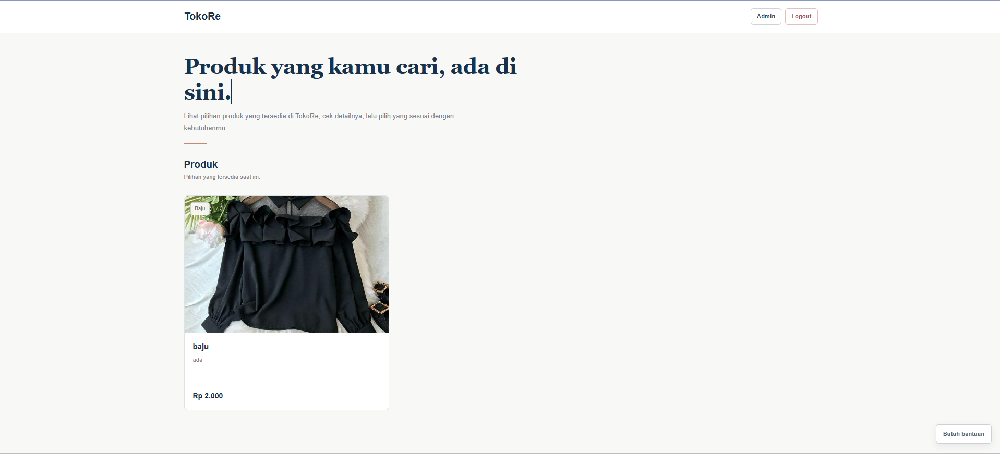
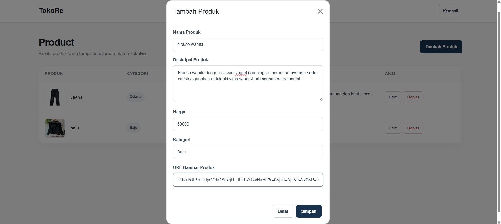
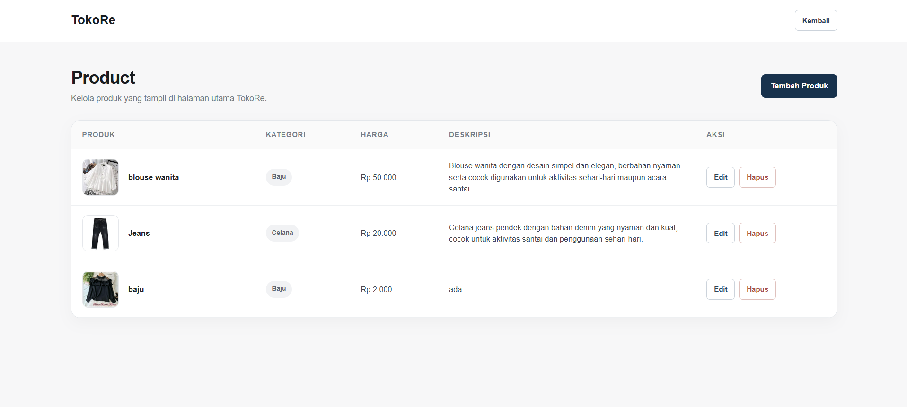
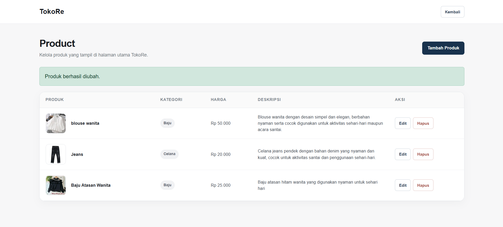
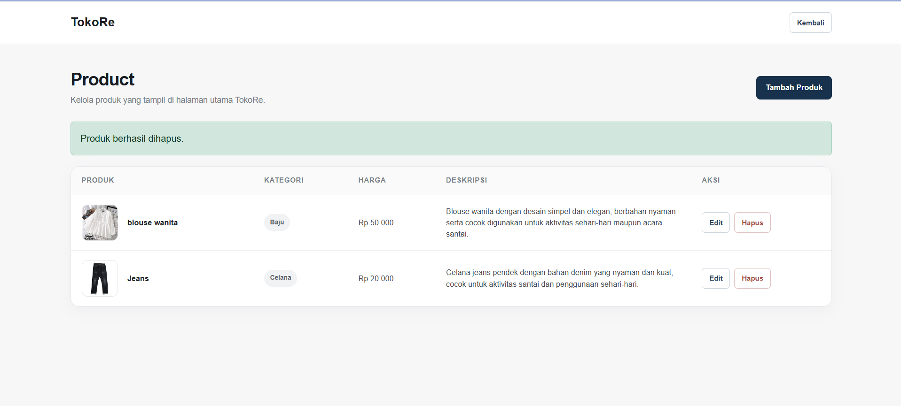
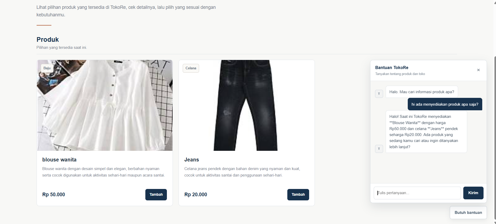
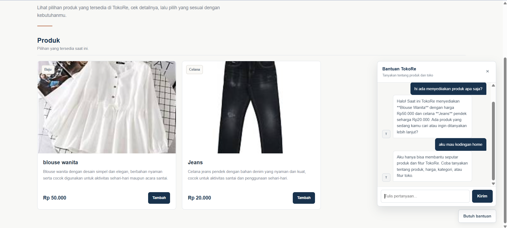

# TokoRe

TokoRe adalah website toko sederhana yang dikembangkan untuk tugas Pengembangan Desain Web Pertemuan 12. Aplikasi ini memiliki katalog produk, keranjang belanja untuk pengunjung, halaman Admin Product untuk pengelolaan produk, serta AI Chat yang dapat menjawab pertanyaan berdasarkan produk dan fitur yang tersedia di TokoRe.

## Tujuan Pengembangan

Pengembangan dilakukan untuk menambahkan pengelolaan produk melalui halaman admin dan meningkatkan kemampuan AI Chat agar dapat memberikan jawaban yang sesuai dengan konteks aplikasi.

Beberapa kebutuhan utama yang dikembangkan:

- Menambahkan fitur Product.
- Membuat halaman Admin Product.
- Menambahkan CRUD Product.
- Menyediakan informasi nama, deskripsi, harga, kategori, dan gambar produk.
- Menghubungkan katalog produk dengan AI Chat.
- Menambahkan AI Guardrail agar pertanyaan di luar konteks ditolak atau diarahkan kembali.
- Menyediakan keranjang belanja tanpa mengharuskan pengunjung login.
- Membuat tampilan responsif untuk desktop dan mobile.
- Memisahkan kode berdasarkan fitur agar lebih mudah dipelihara.

## Fitur

### 1. Katalog Produk

Pengunjung dapat langsung melihat produk yang tersedia tanpa login. Setiap produk menampilkan:

- Gambar produk.
- Nama produk.
- Deskripsi produk.
- Harga.
- Kategori.

Gambar produk dibuat lebih dominan dan memiliki efek zoom ringan ketika cursor diarahkan ke gambar.

### 2. Keranjang Belanja

Pengunjung dapat langsung menambahkan produk ke keranjang tanpa login.

Fitur keranjang meliputi:

- Menambahkan produk.
- Menambah jumlah produk yang sama.
- Melihat jumlah barang pada tombol Keranjang.
- Melihat daftar barang di keranjang.
- Menghapus produk dari keranjang.
- Menghitung total belanja.

Data keranjang disimpan pada browser menggunakan `localStorage`.

### 3. Login Admin

Login hanya digunakan untuk admin. Pengunjung biasa tidak perlu login untuk melihat produk atau menggunakan keranjang.

Admin yang berhasil login dapat mengakses halaman pengelolaan produk.

### 4. Admin Product

Halaman Admin Product digunakan untuk mengelola katalog produk.

Fitur yang tersedia:

- Create: menambahkan produk baru.
- Read: melihat daftar produk.
- Update: mengubah data produk.
- Delete: menghapus produk.

Data produk terdiri dari:

- Nama produk.
- Deskripsi.
- Harga.
- Kategori.
- Gambar produk.

### 5. AI Chat

TokoRe memiliki AI Chat yang terhubung dengan data produk yang tersedia di aplikasi.

AI dapat membantu menjawab pertanyaan seperti:

- Produk apa saja yang tersedia?
- Berapa harga suatu produk?
- Produk tersebut termasuk kategori apa?
- Bagaimana deskripsi produk?
- Pertanyaan mengenai fitur toko.

AI diarahkan untuk memberikan jawaban yang natural dan tidak menjelaskan informasi teknis internal kepada pengunjung.

### 6. AI Guardrail

AI Guardrail digunakan untuk membatasi percakapan agar tetap berada dalam konteks TokoRe.

Contoh pertanyaan yang sesuai:

> Ada produk apa saja?
> Berapa harga produk ini?
> Produk ini kategorinya apa?

Contoh pertanyaan di luar konteks:
> Siapa pemain sepak bola terbaik?
> Buatkan puisi tentang sekolah.

Untuk pertanyaan di luar konteks, AI tidak memberikan jawaban umum dan mengarahkan pengguna kembali ke topik produk atau fitur TokoRe.

AI juga diarahkan untuk tidak mengarang nama produk, harga, kategori, stok, diskon, atau informasi lain yang tidak tersedia.

## Teknologi yang Digunakan

### Frontend

- HTML5
- CSS3
- JavaScript
- Bootstrap 5
- Web Components
- `localStorage`

### Backend

- Node.js
- Express.js
- SQLite
- REST API

### AI

- Google Gemini API
- Gemini Interactions API
- Gemini 3.6 Flash

## Cara Menjalankan Project

Pastikan Node.js sudah terpasang.

### 1. Clone repository

```bash
git clone https://github.com/nabilaghnaaa/PDW-ANTARA-WEEK13-20230140154.git
cd PDW-ANTARA-WEEK13-20230140154
```

### 2. Install dependency

```bash
npm install
```

### 3. Buat file `.env`

Di Windows PowerShell gunakan:

```powershell
Copy-Item .env.example .env
```

Kemudian buka file `.env` dan isi konfigurasi yang diperlukan.

Contoh:

```env
PORT=3000
DB_PATH=./database.sqlite
ADMIN_USERNAME=admin
ADMIN_PASSWORD=rahasia
GEMINI_API_KEY=ISI_API_KEY_GEMINI
GEMINI_MODEL=gemini-3.6-flash
```

`GEMINI_API_KEY` wajib diisi agar fitur AI Chat dapat digunakan.

### 4. Jalankan project

```bash
npm start
```

Server akan berjalan pada:

```text
http://localhost:3000
```

### 5. Mengakses halaman admin

Login admin dapat dibuka melalui:

```text
http://localhost:3000/login-page
```

Setelah berhasil login, halaman Admin Product dapat diakses melalui:

```text
http://localhost:3000/admin/products
```

## Validasi Product

Product memiliki validasi pada sisi backend agar data yang disimpan sesuai kebutuhan aplikasi.

Validasi meliputi:

- Nama wajib diisi.
- Deskripsi wajib diisi.
- Harga harus berupa angka dan tidak boleh negatif.
- Kategori wajib diisi.
- URL gambar, apabila diisi, harus menggunakan `http` atau `https`.

## Dokumentasi Screenshot

Seluruh screenshot hasil implementasi ditempatkan pada folder images

### Admin Product



### Create / Add Product



### Read / List Product



### Update Product



### Delete Product



### AI Chat Sesuai Konteks



### AI Guardrail


    
## Ketentuan Tugas yang Dipenuhi

| Ketentuan | Implementasi |
|---|---|
| Product | Katalog produk tersedia pada dashboard |
| Admin Product | Halaman khusus pengelolaan produk |
| Create | Admin dapat menambahkan produk |
| Read | Admin dan pengunjung dapat melihat produk |
| Update | Admin dapat mengubah produk |
| Delete | Admin dapat menghapus produk |
| Nama produk | Tersedia pada data product |
| Deskripsi | Tersedia pada data product |
| Harga | Tersedia pada data product |
| Kategori | Tersedia pada data product |
| Gambar | Tersedia pada data product |
| AI Chat | Terhubung dengan katalog produk |
| AI Guardrail | Membatasi percakapan sesuai konteks TokoRe |
| Responsive | Tampilan menyesuaikan desktop dan mobile |

## Catatan Penggunaan

Pastikan API key Gemini hanya disimpan pada file `.env` dan tidak diunggah ke repository.

File `.env.example` digunakan sebagai template konfigurasi, sedangkan nilai asli API key disimpan pada `.env`.

## Repository

```text
https://github.com/nabilaghnaaa/PDW-ANTARA-WEEK13-20230140154.git
```

## Author

**Regina Rana Nabila**

NIM: **20230140154**
